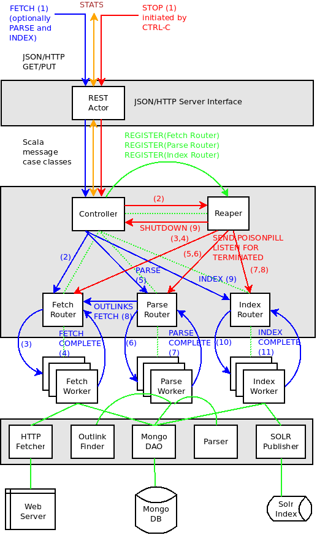

#DELSYM - An Akka based Content Pipeline

DELSYM is an Actor based Content Ingestion Pipeline. [Actors](http://www.scala-lang.org/old/node/242) allow us to asynchronously distribute work among entities that do discrete peices of this work in a synchronous manner. Delsym's pipeline is similar to that for [Apache Nutch](http://nutch.apache.org/) (more specifically the NutchGORA branch with its dependence on a NoSQL database), but the implementation uses [Akka](http://akka.io/) instead of [Apache Hadoop](http://hadoop.apache.org/).

The architecture diagram for the pipeline is shown below. The central block describes the Actors and Messages, the lower block shows the interactions with various data stores and the upper block represents the HTTP/JSON REST interface the pipeline exposes to clients.

Processing is initiated by a Fetch request sent to the REST API as payload within a HTTP PUT request. The request contains the URL of the page to be processed, the process depth (for crawls), and any fetch level metadata (such as titles and summary from feeds). The REST API transforms this payload into a Fetch message which is sent to the Controller actor. The Controller actor sends it to the Fetch Router Actor which sends it to one of the Fetch Worker Actors. The Fetch Worker downloads the URL and stores the content, along with the depth and metadata if specified, into a [MongoDB](http://www.mongodb.org/) record. Once done, it sends back a FetchComplete message to its router, which causes the Controller to send a Parse message to the Parse Router Actor which forwards it to one of the Parse Worker Actors. The Parse worker parses out the text from the document, extracts specific key value pairs and updating the MongoDB record with this information, and sends back a ParseComplete to its router when done. This causes the Controller to send an Index message to the Index Router Actor which forwards it to one of its Index Worker Actors. The Index Worker Actor retrieves the document from MongoDB and writes it out to an [Apache Solr](http://lucene.apache.org/solr/) instance, and sends back an IndexComplete message back to its router when done. This completes processing for a single document.

For Fetch messages which specify a positive depth, the Controller parses the content for outlinks and creates Fetch messages with these outlinks and depth-1 and sends it to the Fetch router. One can also short circuit the pipeline by only sending a Parse or Index message (for example to fix a bug in these areas), which will cause the document to be processed from that point to completion. It is also fairly easy to add support to enable only Fetch, Index or Parse, if needed.

The pipeline also supports a Stats message which allows clients to find the size of the 3 queues (fetch, parse and index) at any point in time.

To Stop the system, a client sends a Stop message to the pipeline, which will cause its queues to be drained sequentially, and once all queues are drained, the actors are all killed. This is implemented using the Reaper actor which watches the routers for termination. The Stop message is not directly made available via the REST API, but is implemented as a shutdown hook, which is activated when the HTTP server is killed.

To test out the system, run the following commands to download DELSYM and run the HTTP REST server on one terminal:

    git clone https://github.com/sujitpal/delsym.git
    cd delsym
    cd src/main/resources
    ln -s application.mock application.conf
    cd -
    sbt "run-main com.mycompany.delsym.rest.Main"

From another terminal, issue the following commands to see the queue sizes:

    curl localhost:8080/stats

Or to send a fetch request:

    curl -X PUT -H "Content-Type: application/json" \
        -d '{"url":"http://www.foo.com/bar", "depth":0, "metadata":{}}' \
        http://localhost:8080/fetch

The pipeline is currently running using Mock actors (using [application.conf.mock](src/main/resources/application.conf.mock) so all these commands do is to activate actors that write their actions to the log and update some internal counters. In production mode, the pipeline expects to find a MongoDB instance and a Solr instance. Please relink application.conf from [application.conf.local](src/main/resources/application.conf.local) for local mode and [application.conf.remote](src/main/resources/application.conf.remote) for remote mode operation.

The MongoDB database and collection must also be created prior to use, as well as the unique index on the URL field. Use the following commands in the mongo shell to do so.

    use delsymdb
    db.documents.ensureIndex({"url": 1}, {unique: true})

The schema.xml for the Solr (4.6) example application already contains all the fields that are necessary for the pipeline to work with existing components. However, if you want to add different fields, make sure that your solrfieldnames and dbfieldnames in application.conf and your Solr schema.xml are updated accordingly.

Akka allows us to create applications that are distributed by design, so one way to scale out this application across multiple nodes is to give the worker actors their own (cluster of) nodes. To do this we need to create remote Akka ActorSystems on remote machines (configurable from [remote.conf](src/main/resources/remote.conf)) onto which the routers from the master node (configured by [application.conf.remote](src/main/resources/application.conf.remote) creates workers. To start up a remote Akka ActorSystem named remote listening on localhost:2553, run the following command:

    sbt "run-main com.mycompany.delsym.remote.RemoteAkka remote"

On another terminal, setup and run the master node. This starts up an ActorSystem named Delsym on localhost:2552. The master node (as before) also exposes a JSON/HTTP REST interface on localhost:8080.

    cd src/main/resources
    ln -s application.conf.remote application.conf
    sbt "run-main com.mycompany.delsym.rest.Main"

From yet another terminal, feed it the GET and PUT commands using cURL as before. You will see log messages on the remote Akka ActorSystem (localhost:2553) indicating that the work of fetching, parsing and indexing is occurring on that. Currently, remote mode uses the Mock actors (set testuser=false in application.conf.remote to change that) so its not doing anything useful.

A slightly more verbose perspective can be found in my blog posts, which I wrote as I was developing the pipeline.

* [Akka Content Ingestion Pipeline, Part I](http://sujitpal.blogspot.com/2013/12/akka-content-ingestion-pipeline-part-i.html)
* [Akka Content Ingestion Pipeline, Part II](http://sujitpal.blogspot.com/2013/12/akka-content-ingestion-pipeline-part-ii.html)
* [Akka Content Ingestion Pipeline, Part III](http://sujitpal.blogspot.com/2013/12/akka-content-ingestion-pipeline-part.html)
* [Akka Content Ingestion Pipeline, Part IV](http://sujitpal.blogspot.com/2014/01/akka-content-ingestion-pipeline-part-iv.html)

